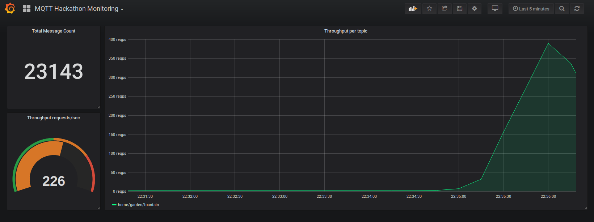
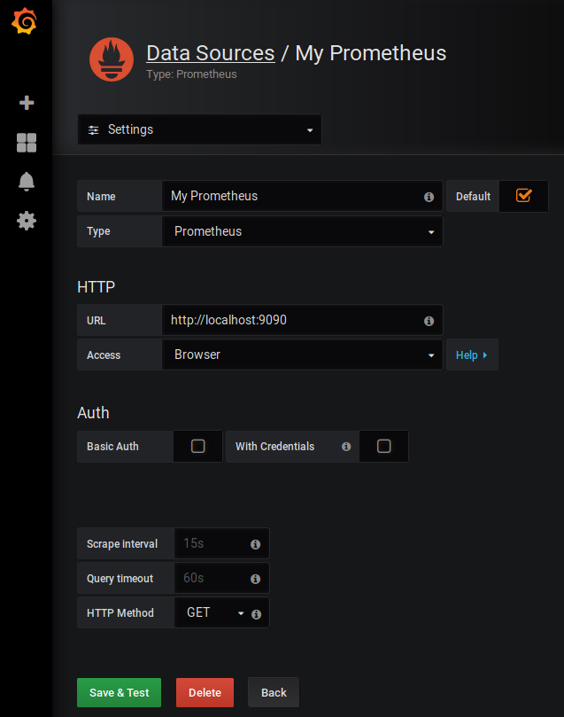

# MQTT Hackathon Topic Monitoring

_Disclaimer: this app was created during a MQTT hackathon._

This repository contains a small app written in Golang for monitoring a list of MQTT topics. Basically, this app counts the number of received messages for each given topic in order to calculate the throughput in messages per second.
Metrics are exposed through a [Prometheus](https://prometheus.io/) endpoint which can then be visualized through a [Grafana](https://grafana.com/) dashboard included in this repository.



## Start a local MQTT broker

```bash
docker run -it -p 1883:1883 eclipse-mosquitto
```

## Build and run this app

```bash
go build

LOGXI=* ./mqtt-monitoring -broker "tcp://127.0.0.1:1883" -topics "test"
```

If you don't have a MQTT client for publishing messages, you can use [MQTT.fx](https://mqttfx.jensd.de/). Publish some messages to the topic `test` and watch the console output of the Golang app or take a look at the Grafana dashboard.

## Start Prometheus & Grafana

* Start Prometheus:
  ```bash
  docker run \
      -d \
      --rm \
      --network host \
      -p 9090:9090 \
      -v $(pwd)/prometheus.yml:/etc/prometheus/prometheus.yml \
      --name prometheus \
      prom/prometheus
  ```

* Start Grafana:
  ```bash
  docker run \
    -d \
    --rm \
    -p 3000:3000 \
    --name=grafana \
    grafana/grafana
  ```

* Open Grafana in your browser on [localhost:3000](http://localhost:3000/login) and login with the credentials `admin` and `admin`.

* Create a Prometheus datasource to connect to Prometheus:

  

* Import the Grafana dashboard from the file `grafana-dashboard.json` into Grafana.
